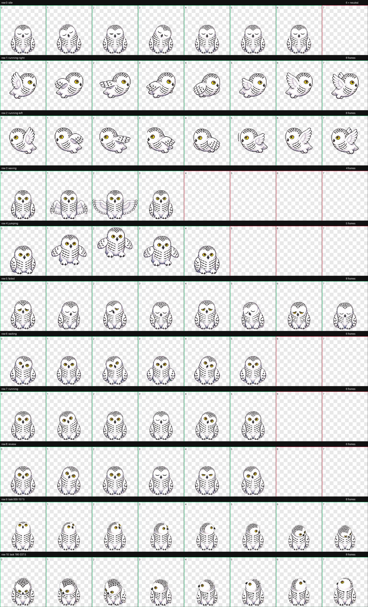

# 雪团（Snowy Owl Pet）

雪团是一只白色圆球雪鸮，也是一个 Codex v2 动画宠物。它采用像素风格，包含黄色眼睛、黑色尖嘴和雪鸮特有的黑色羽毛花纹。

## 安装

1. 下载或克隆本仓库。
2. 将 `xuetuan-snowy-owl` 文件夹复制到：
   - Windows：`%USERPROFILE%\.codex\pets\xuetuan-snowy-owl`
3. 完全退出并重新启动 Codex。

`pet.json` 已指向当前图集 `spritesheet-xuetuan-shortwing-v11.webp`。

## 动画

- 默认／空闲：眯眼、眨眼与左右歪头
- Codex 工作中：睁眼、眨眼与好奇歪头
- 鼠标拖拽：左右飞行
- 工作完成：正面展翅
- 工作失败、等待输入、审核／思考：分别使用独立表情循环
- 鼠标跟随：包含 16 个注视方向

图集遵循 Codex 宠物 v2 格式：8 列 × 11 行、单格 192 × 208 像素，总尺寸 1536 × 2288。最新图集已通过验证，验证结果见 [`validation.json`](xuetuan-snowy-owl/validation.json)。

## 当前版本

- 宠物 ID：`xuetuan-snowy-owl`
- 图集版本：v11
- SHA-256：`8E313E0FB69DC848781AE409221211E6746403E02F187B6CCABB6932D09745B8`
